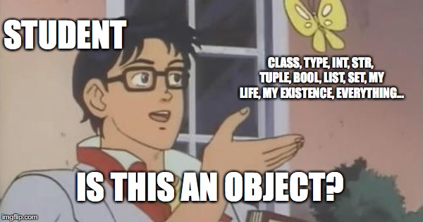
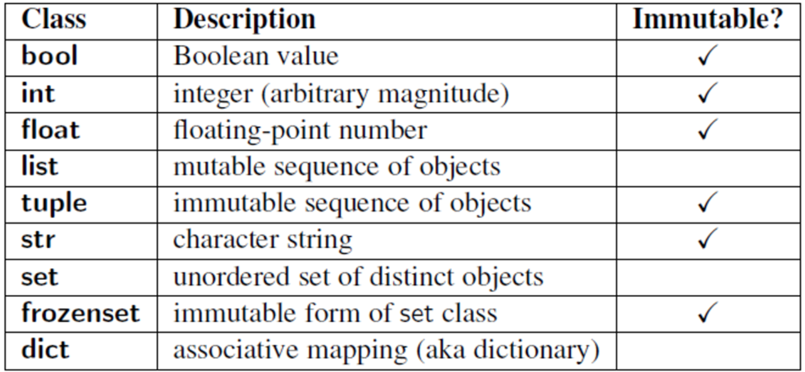

|[Table of Contents](/00-Table-of-Contents.md)|
|---|

---

## Variables



## EVERYTHING IN PYTHON IS AN OBJECT!

This is the single, most important thing taught in Python. The sooner you have an understanding of Python Objects, the quicker everything else falls into place. *Objects* are pieces of code that are designed to be interchangaeble and thus reused, but more on this later.

**Data types are dynamic based on the variable stored. To check type, use:**

#### **type\(**var**\)**

```python
# python2
x = 10
type(x)
# output: <type 'int'>

# python3
# output: <class 'int'>
```

Notice the output is &lt;**class** 'int'&gt; or &lt;**type** 'int'&gt;.... Type and class are interchangeable for our purposes. There was a time when they wern't. Once again, everything in Python is an object! We will go over type\(\) more in meta-classes.

#### Multiple assignment

Multiple assignment is allowed and types can be the same or different:

```python
# All == 100
a = b = c = 100

# Will only reassign variable c
c = 200

print ('a = {} b = {} c = {}'.format(a, b, c))
# output: a = 100 b = 100 c = 200

# will change all three variables
a,b,c = 100, 'hello', {}
print ('a = {} b = {} c = {}'.format(a, b, c))
#output: a = 100 b = hello c = {}
```

## Data Types

* **Numbers**
  * int, long, float, *complex*
* **Strings**
* **Lists**
  * Think array
* **Tuples**
  * Think constant array
* **Dictionaries**
  * Think associative array

### Data Types: Immutable

**Immutable objects** are those that can't be changed without reassigning. Such as int or str. **Mutable objects** are those that can be changed. Such as list or dict. Below is a table with all types and their mutability.



**Continue to Performance Lab:** 2A

---

|[Lab 2A](/02_Data_Types/lab2a.md)|
|---|
