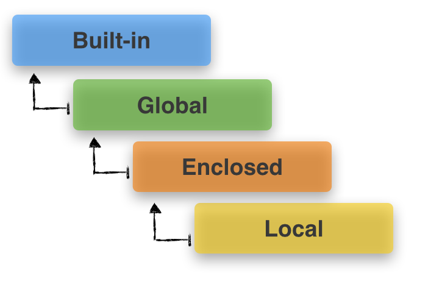

|[Table of Contents](/00-Table-of-Contents.md)|
|---|

---

## Scope

Scope refers to the visibility of variables. To be more clear, what parts of your program see which variables. In Python, we use the  **LEGB Rule:**



### Local:

* Defined in the local scope of functions

```python
def sales_tax(amount):
    rate = 0.0625 # Local variable
    tax_total = amount * rate # rate can be seen here
    total = tax_total + amount
    print(total)

# Call function and pass parameter
sales_tax(200)  # Rate cannot be seen here
```

### Enclosing-Function Global

* Refers to variables defined within local scope of functions wrapping other functions

```python
def program():
    amount = 200 # Enclosing-Function Global variable
    def sales_tax():
        rate = 0.0625
        tax_total = amount * rate # Amount can be seen here
        total = tax_total + amount
        print(total)
    sales_tax() # Amount could be seen here

# Amount could not be seen here
program()
```

### Global/Module

* Variables defined at the top level of files and modules

```python
amount = 200 #Global variable, can be seen everywhere below. 

def sales_tax():
    rate = 0.0625
    tax_total = amount * rate
    total = tax_total + amount
    print(total)

# Did not pass parameters
sales_tax()
```

### Built-In

* Loaded into scope when interpreter starts up. \(Ex: hash\(\), min\(\), dict\(\), print\(\), etc\)

### Modifying Global Variables Within a Different Scope

* We can use the **global** keyword to grant access to global variables within a different scope, allowing for modification. 

**Example:**

```python
a = 1

# Uses global because there is no local 'a'
def f():
    print('Inside f() : ', a)

# Uses local variable a
def g():    
    a = 2
    print('Inside g() : ', a)

# Uses global keyword to grant access to global a, allowing modification
def h():    
    global a
    a = 3
    print('Inside h() : ',a)

# Global scope
print('global : ', a)
f()
print('global : ', a)
g()
print('global : ', a)
h()
print('global : ', a)
```

**Output:**

```text
global :  1
Inside f() :  1
global :  1
Inside g() :  2
global :  1
Inside h() :  3
global :  3
```

---

|[Next Topic](/04_functions/02_user_functions.md)|
|---|
